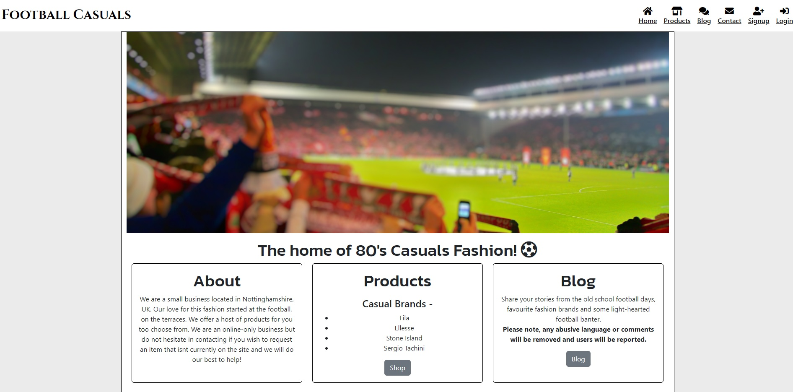

# Football Casuals

[View deployed site here](https://footballcasuals.herokuapp.com/)

Football Casuals is a online clothing store specialising in the 'Casuals' genre.
Selling specialist range clothing from brands such as fila, ellesse, sergio tachini and many more. Customers can register for an account which gives them access to the blog, this also allows them to add products into their bag to purchase. All users can browse the products however they wont be able to add into the bag until they log in. Admin / Staff users can delete products if they are no longer available, they can also add new products onto the site that have came into stock. All users can then also go into the contact section to which they are presented with a form so that they can ask any queries or for if they are after a certain product sourcing that isnt currently on the site.

The site is laid out with clear information, minimalistic design so that the user can take in all the information in front of them. All products are laid out neatly with the product image taking centre stage to really try and sell the products themselves. The checkout process is simple and effective allowing for ease of purchase with then a confirmation email sent to the user to confirm that their order has reached the shop and will be despatched as soon as possible.

## Planning

- [View website planning Q's](https://docs.google.com/document/d/1C3_8yjV5OL-vI_vUVK-uQ40GAQa17Ybtdwm-NSfwbU4/edit?usp=sharing)
- [View homepage design](static/home_page.png)

- The main theme of the website was constructed through the original mockup which then allowed me to create the base.html. From here i used the user stories and feature planning to really design
the page and this allowed me freedom with the project creation scope to get creative and take time to see what worked best and where.

## User Stories

1. As an admin user I want to be able to add new products onto the site
2. As an admin user I want to be able to delete products once they are no longer available
3. As an admin user I want to be able to delete blog post comments
4. As a site user I want to be able to see what the site is going to offer me
5. As a site user I want to be able to browse the products that are on sale
6. As a site user I want to be able to choose with size I want for a particular product
7. As a site user I want to be able to choose the quantity of a certain product that i am buying
8. As a site user I want to be able to get in touch with the store online
9. As a site user I want to be able to chat to fellow fashion lovers like myself
10. As a site user I want to be able to get my own account
11. As a site user I want to be able to pay via the website online

## Design

- I have maintained a similar layout throughout the website, with good contrast levels
using a light grey for the main body and white for the nav bar, i like to ensure that the design is minimalistic to really ensure focus is set onto the sites content. Each main part of the site is housed within a container, and different functions / tools within the site for the majority have their own card to keep a structured layout. I feel that the design of the site allows for any user to easily navigate around and all headings are clear enough for any user to go exactly where they desire, working to a RFT mindset (Right First Time).

## Features

- Information content page
- Store product page
- Bag functionality (CRUD implemented)
- Blog page with posts and comments
- Store owners store stock control (CRUD implemented)
- Contact page with relevant form
- User login pages
- Checkout system that accepts online payments

### Base Template

- The head of each page includes the nav bar primarily which consists of the brand logo and the navigation links. The logo is a link to the home page that can be used from any webpage
within the website
- Non-logged in users see products, account register and login, blog (although cannot access the page, automatically directed to login page)
and contact links
- Logged in users see products, blog, contact, and logout
- Admin users see all of the above plus a manage tab which is used for staff members to easily add products through the front end

### Home page

- Home page starts with a related image of a football stadium, due to the casual fashion sense having links to the football culture
- Page is then split up into 3 major website categories, one being the card explaining information about the business,
the other being a short description of products on offer with a button link to the products and the last one introducing the blog part
of the site and a note around expectation of user behaviour.
- The newsletter powered by mailchimp is also here to allow users to subscribe for latest information and offers

### Products page

- All products are listed on this page, in a responsive manner, which consist of a card for each product with the related information i.e name, description
pricing and category. All products are links to which logged-in users can see the product detail page.

### Product Detail page

- Admin users have access to a delete function of this page which allows them to delete a product from the database, for situations where the item may now be
out of stock of discontinued
- This is where the logged in user can choose the product size and the quantity of products that they would like to purchase, they then do this by clicking the add to bag button.
Users also have a button for keep shopping which will return them to the products page to add more products into their bag

### Product Delete page

- This is a simple display page that emphasises the importance to confirm this is the action the admin wants to take as this can cannot be undone.

### View bag page

- This page is only accessable for logged in users, this gives them a table to display their product that they have put into their basket with all the relevant information, for
example the size that they picked and the quantity.
- The bag total is also displayed so that the user can see how much the order is going to cost them if they do wish to checkout
- Users are able to click 'remove' in which they can remove items from their basket that they do not need, if they remove all products from their bag, the whole display of the page
changes to show no products are in the bag and a sad-face icon.

### Checkout page

- This page again shows the users basket to double check that everything is still correct and the user knows exactly what product they are ordering and how much the outstanding balance
is for them to pay.
- On the right hand side of the page, there is then a form for the user to input their details for delivery and payment
- At the bottom of this section their is then the stripe payment box to add the card details in for the user, this validates while inputting to ensure that the card details are correct before continuing with the order.

### Order-Confirmation page

- This page quotes the order number that was just created for the user, shows them again the items and the amount they have paid. There are also messages that confirm the same thing if the purchase has gone through.

### Blog page

- This page shows the blog post topics that are currently open with their title and description with a handy button to enter into the blog chat.

### Blog Comment page

- This page shows the topic details to the top of the page
- A convenient body field to input their message and a button below to post
- Below this there is then what resembles a chat layout, which quotes the date and time posted, the users name and finally their message
- On messages that have been created by that particular user (or admin) there is also a delete function to remove comments from the blog discussion

### Contact page

- This page is accessible by all users and opens a form with fields for name, email and message and a submit button
- Open a form submit the page will then reload to allow for any other requests

### Manage page

- This page is for admins only as this is the form that allows users to add a new product onto to the system, with all the relevant fields to match up to the back-end data model
- Upon completion of this form there is then a redirect onto the products page where the new product will display alongside the others, as well as a temporary message at the top of the page.

### Continous Improvement Features

- I would like to create a proper functioning profile app
- I would like to develop the admin front end features further so everything is accessibile
- Add full CRUD functionality to all website features for appropriate users
- Create a stock system instead of admins currently needing to delete products

## Technologies Used

- HTML5
- CSS
- Python
- Postgres
- Cloudinary
- Bootstrap
- Font Awesome
- Google Fonts
- Django
- Stripe
- Django Allauth
- Gunicorn
- DevTools
- Visual Studio Code
- Heroku

## Business Model / Marketing

### Business Model

Football Casuals is B2C(Business to customer) application due to the fact that it is primarily intended and designed around a individual client creating single orders. They can purchase clothing items online via a single payment and they will be delivered to their location of choice.

### Marketing

- Social media is arguably the best source of marketing for the modern world, this store has also got a facebook account to put itself on the market and advertise its purpose further
- Meta tags used within the website to improve the SEO
- Email newsletters via the Mailchimp utility
- [View facebook page](static/facebook_page.png)

## Agile Methodology

- [View Google Docs Agile Job Board](https://docs.google.com/spreadsheets/d/1QLs2885t0_M3ZYBUZVLHK893Sn1aK-klLWDD3ABH0Us/edit?usp=sharing)
- Github project board also set to Public

## Testing

### Admin user story testing

- 'Add new products' - navigate onto the manage page from the nav bar(testing successful for tab only being accessibile by a logged in admin)
form loads okay, complete form and click submit. Product added into the database
as it was accessibile from the admin panel. Bug found that the site then tries to redirect back to the view that handles the POST method of adding the product
this was due to the redirect going into the wrong view function, altered this to redirect to the general products page which then loaded fine.

- 'Delete products' - this function is within the product detail page for the particular product, click on a certain product which performs the get request
the delete button should then be visible (only if an admin), upon clicking delete the site then redirects back to the general products page but without
the product that was just deleted, visible success message shown on screen, and process confirmation then passed within admin panel as product now
doesnt exist in the back end either.

- 'Create blog posts' - this function is unfortunately only available via the back end for the purpose of project submission, although testing was still completed within the
development stage to create the layout of the web page templates, due to it being with the admin back end panel, all functionality is working correctly, i can enter all information
within the form and then save and/or delete a post

- 'Delete blog comments' - this function sits within the admin backend due to time constraints for project submission, although all functionality is working correctly
as expected.

### User story testing

4.This user story is fulfilled by being able to access the home page. webpage loads fine, links to the home page are done via the base.html so link is accessible from wherever within the website the user is. This also doesnt require any login.

5.Products page is accessible through the home page shop link and also through the navigation bar, both buttons tested are function correctly. User is also able to get more details about the product by clicking the product which takes them to a product detail page with the products slug as an argument, this works with any product that i have created.

6.User is able to choose a size from the dropdown box in the product detail page, the sizing options are the same for all products. This information is then set once the user clicks on add to bag which then updates(CRUD) the users bag in readiness for checkout. If the admin state that the product doesnt have any sizes then the size option isnt available for the customer to choose, which is correct in a sense as some items of clothing may not require sizing, however also means that the admin creating the product needs to ensure that they input the correct information into the new product form.

7.User is able to adjust the product quantity within the product detail page. Tested that whichever number is put into the quantity box then transfers into the bag display, this also then contributes towards the total price for the order. There is correct validation onto the quantity box for example tested to ensure that the user cannot enter 0 or a letter.

8.Test through different user accounts and non logged in account that the user can access the contact form, which they can. Contact form then requires a name, email and message as set out in the back end model. Contact form testing successful that the form is then sent into the back end (future improvement for these forms to be sent into a personal email address), upon completion of the form the site then successful redirects back to the form page for if the users wishes to complete the form again. the website visually reloads so the user knows that the form has been sent.

9.Test that the blog posts pages load correctly is ok. The comment button to enter in the particular blog post button works correctly. Form to add a comment displays correctly, tested that the input into the comment body field is then passed back to the users in the comments boxes underneath with the correct date/time and the user account, all of which passed okay.

10.User is able to access the login or register links from the main navigation bar, links tested and work correctly. Form works correctly. Message displayed once user is logged in to show login state, this is also backed up with the change in nav bar headers. Users can be made admin users from within the back end, testing passed and complete.

11.Payment system provided through stripe, formatting onto the card box functions correctly, tested through using dummy card numbers, successful transaction is displayed within a webpage outlying the order confirmation details, a success message is also displayed on the webpage. Incorrect card numbers do not allow for the user to submit the checkout form therefore doesnt process the order and create the order number. Delivery form has sufficient validation to ensure that the fields are completed.

### Automatic Testing

- W3C HTML Testing Service - Ok
- W3C CSS Testing Service - Ok
- PEP8 Testing Service - Ok
- JSHint Testing Service - Ok

### Manual Testing

- DevTools - Dev tools was used through the project to test responsiveness, and design layouts
- Stripe false bank cards - To put purchases into practise to carry out testing and handle checkout correctly.
- Extensive time spent in the development server testing functionality as functions were created
- Debug False testing completed at intervals within development to confirm functions are correct in production
environment instead of encountering errors within a final code push up to project submission
- Bag functionality testing - items added into the bag multiple times, which updates the navbar bag price display, and product information is viewable in the bag page. Test delete product from bag works, which then also switches the bag display page to say there are no products in the bag and a handy button to return to the products page.
- Newsletter accepts an email and shows a feedback message.

## Deployment

### My project deployment

- This project is deployed via Heroku
- My project was created in Gitpod
- Git was used for Version Control
- My project was deployed once I had completed the majority of manual testing.

### Deploying Via Heroku

Create an env.py file, you will need the following variables for your project at a minimum -

- SECRET_KEY: (randomly generated)
- CLOUDINARY_URL: Copy your CLOUDINARY_URL from the dashboard
- DATABASE_URL: This is the value of DATABASE_URL in Heroku
- Make sure in settings.py to set the ALLOWED_HOSTS value to use your localhost and Heroku app name.

### Deploying to Heroku

To deploy to Heroku follow these steps:

1. Locate the New button at the top right end side of the dashboard.
2. Click on Create new app, select your region and pick a suitable name for your project.
3. In Settings add buildpack Python.
4. Add Database to App Resources. Go into the Resources Tab then Add-ons then search and add Heroku Postgres.
5. In the Settings Tab, in Config Vars, make sure you have the DATABASE_URL added with the previous step and to add the other variables: SECRET_KEY and CLOUDINARY_URL. Ensure the variables here are then matched up with the env.py
6. Select Deploy from the navigation bar
7. Select the deployment method of Github and seach for your repository.
8. Proceed to link the Heroku app to the repository by clicking on connect.
9. Click on Deploy.

### Forking a Repository

- Forking is a good utility to use to make a copy of an original repository so that this can be edited without making any changes to the original development repository.

- Locate a repository you wish to copy

- The Fork button is above the repository control bar to the right.

- Once clicked this will then create the repository copy to your Github account.

### Cloning a Repository

- You can clone a repository straight to Gitpod if needed.

- Locate a repository you wish to clone

- Just below the repository control bar, there is a green Gitpod button.

- This will then open the project in Gitpod for you (if gitpod is installed).

## Credits

- Reuben Ferrante - CI Mentor
- 80s Casuals Classics LTD - Product Images
- Google images - I do not own copyright to any images used within the site
- Slack - Student Chat Platform
- Stack Overflow - Coding Aid
- Stripe / CI - Payment system and related code
